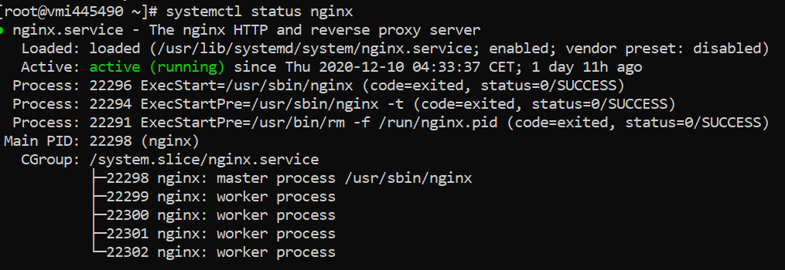
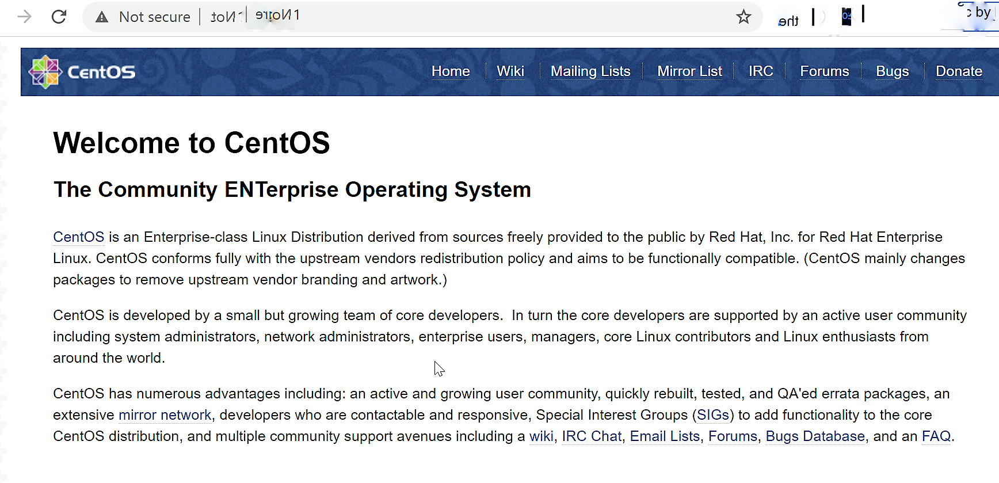

## Introduction

What is Nginx ?
In case you haven't heard about Nginx , think it as a Load Balancer initially , but i tell you it is more than that .
Nginx is a high perforant load balancer and reverse proxy , it can handle much more no of http concurrent requests than Apache .

Nginx can also act as a standalone web server and it is one of the most commonly used multipurpose tool loved by system adfmins .It is extremely popular in handling high traffic due to its event loop architecture . Nginx can handle 10,000 concurrent requests .

In this article we will learn  how to install  Nginx on your CentOS 7 server or machine.


##Pre-Requisistes
A **CentOS/RHEL 7**  production server or a Linux VPS . Make sure you do not have **Port 80** & **PORT 8443** occupied .

## Setup Nginx Repository in Centos 7
In order to setup nginx repository we need to add **Centos7 EPEL** repository.
```bash
sudo yum install epel-release
```
you can also setup in a different way below manually.

## Setup Nginx Repo Manually On Centos7/RHEL

In order to setup manually you can login with root user or any user with which you want your nginx to run .
Create a file ```nginx.repo``` in following directory .

```bash
$ vi /etc/yum.repos.d/nginx.repo
```
lets add the centos 7 repository below , if you have Centos7 Server.

```bash
[nginx]
name=nginx repo
baseurl=https://nginx.org/packages/centos/7/$basearch/
gpgcheck=0
enabled=1
```
Let's add RHEL 7 repository if you have RHEL version .

```bash
[nginx]
name=nginx repo
baseurl=https://nginx.org/packages/rhel/7/$basearch/
gpgcheck=0
enabled=1
```

## Installing Nginx On Centos7
Once we have the repository added we can now install nginx using below command
```bash
sudo yum install nginx
```
Nginx will now get installed on your VPS or Server. Next step is verify installation.
## Verify Nginx Installation 
Now we have installed nginx , next step is to verify if the installation actually works .Let's follow the steps below.
```shell
sudo systemctl enable nginx
sudo systemctl start nginx
```
Above command will register nginx as a systemd service and now we can actually check the status of our service.
```bash
sudo systemctl status nginx
```
OutPut :


Now that your nginx service is up and running , you should be able access it .Although you won't be able to acess it through an IP . let's check few of the configurations if you want nginx access via IP Address.

## Setup Firewalld for Nginx 
Why do we need to update firewalld configurations ? One of the reason is that your centos7 server will by default block all incoming web traffic due to security reasons .

**Firewalld** configuration changes to allow **HTTP** and **HTTPS** web traffic should be done as using below commands.

```shell
sudo firewall-cmd --zone=public --permanent --add-service=http
sudo firewall-cmd --zone=public --permanent --add-service=https
sudo firewall-cmd --reload
```
Now that you have executed all the above commands successfully , you will be now able to access your Centos7 Nginx home page using your IPAddress.

```shell
http://YOUR_IP
```
you should be able to now see the nginx home page .

## Nginx Configurations to Remember
1. ```/etc/nginx/nginx.conf``` is the main configuration file for nginx.
2. In case of an error , navigate to nginx log files inside ```/var/log/nginx``` . You will find two log files ```error.log``` and ```access.log``` .
3. Put all your domains under ```/etc/nginx/conf.d``` create a separate ```domain.conf``` files for all te domain you want to have in your nginx .

## Conclusion
Congratulations ! We have installed nginx now successfully . 
You can host multiple sites in nginx and you can also point your node ,springboot servers using server blocks.

Let us know if you face any issuess during instyallation . We will be happy to help you !!
Happy Coding !!
